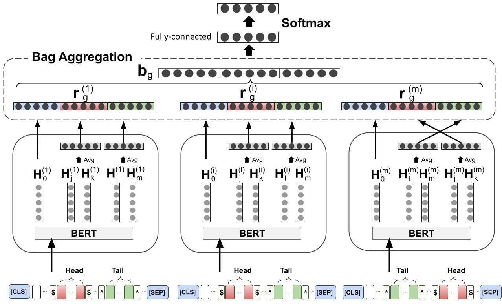

# UMLS-MEDLINE Biomedical Distant RE for Bag-level Multiple Instance Learning

Code for the paper BioNLP 2020 paper *[A Data-driven Approach for Noise Reduction in Distantly Supervised Biomedical Relation Extraction](https://www.aclweb.org/anthology/2020.bionlp-1.20.pdf)*.



## Requirements
`pip install -r requirements.txt`

## Data
To run the code, please obtain the data as follows:

##### UMLS
Install the UMLS tools by following the steps [here](http://blog.appliedinformaticsinc.com/getting-started-with-metamorphosys-the-umls-installation-tool/). Once installed, under `INSTALLED_DIR/2019AB/META`, you can find `MRREL.RRF` and `MRCONSO.RRF`, copy the files and place under `data/UMLS`.

##### MEDLINE
Download MEDLINE abstracts `medline_abs.txt` (~24.5GB) and place under `data/MEDLINE`.
UPDATE: Please follow the discussion here: https://github.com/suamin/umls-medline-distant-re/issues/2

##### Data Creation
1. From project base dir, call the script to process UMLS as: `python -m data_utils.process_umls`. This will create an object `data/umls_vocab.pkl`.
2. Next, run the script `python -m data_utils.extract_unique_sentences_medline`. This might take a while. This will create a file `data/MEDLINE/medline_unique_sentences.txt`.
3. Link the entities with texts: `python -m data_utils.link_entities` (see `config.py` to adjust linking settings).

##### Data Splits
To reproduce the data splits used reported in the paper for `k-tag` setting, run wit default options as `python -m data_utils.create_split`. This will take a while for the first time because of generating the one time file `data/MEDLINE/linked_sentences_to_groups.jsonl`. For next runs, it will use the cached version. For `s-tag`, set the flag `k_tag=False` in `config.py`. For `s-tag+exprels`, additionally set the flag `expand_rels=True`.

## Features
Run `python -m data_utils.features`. Running the job with multi-processing will be significantly faster.

## Train
Run `python train.py`.

#### Checkpoint
Download the best model checkpoint [here](https://cloud.dfki.de/owncloud/index.php/s/9Coe2Hw6zBxjrJo).

## Citation

If you use this code for your research, please consider citing:

```bibtex
@inproceedings{amin-etal-2020-data,
    title = "A Data-driven Approach for Noise Reduction in Distantly Supervised Biomedical Relation Extraction",
    author = "Amin, Saadullah  and
      Dunfield, Katherine Ann  and
      Vechkaeva, Anna  and
      Neumann, Guenter",
    booktitle = "Proceedings of the 19th SIGBioMed Workshop on Biomedical Language Processing",
    month = jul,
    year = "2020",
    address = "Online",
    publisher = "Association for Computational Linguistics",
    url = "https://www.aclweb.org/anthology/2020.bionlp-1.20",
    pages = "187--194"
}
```

**Update (08/04/2022)**: Please check our follow-up work on new Bio-DSRE benchmark using PubMed-SNOMED CT called MedDistant19:

```bibtex
@inproceedings{amin-etal-2022-meddistant19,
    title = "MedDistant19: A Challenging Benchmark for Distantly Supervised Biomedical Relation Extraction",
    author = "Amin, Saadullah and
    Minervini, Pasquale and
    Chang, David and
    Neumann, Günter and 
    Stenetorp, Pontus",
    booktitle = "Proceedings of the 21st Workshop on Biomedical Language Processing",
    month = may,
    year = "2022",
    address = "Online",
    publisher = "Association for Computational Linguistics"
}
```

## Acknowledgements 
We thank Qin Dai (<daiqin@ecei.tohoku.ac.jp>) for guiding us on steps to obtain the relevant triples data from the UMLS in private communication.
